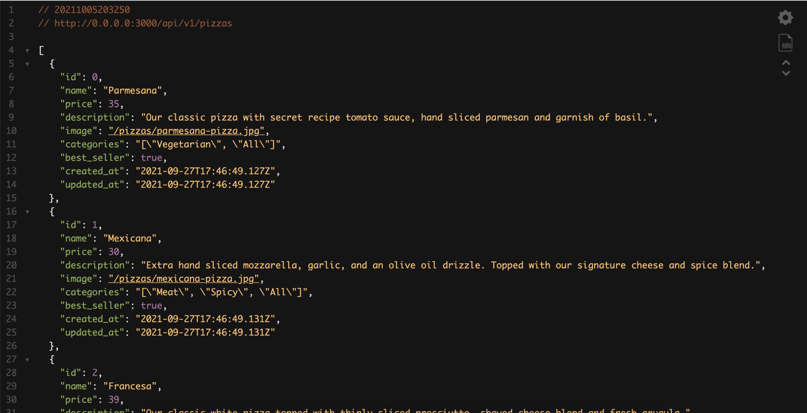
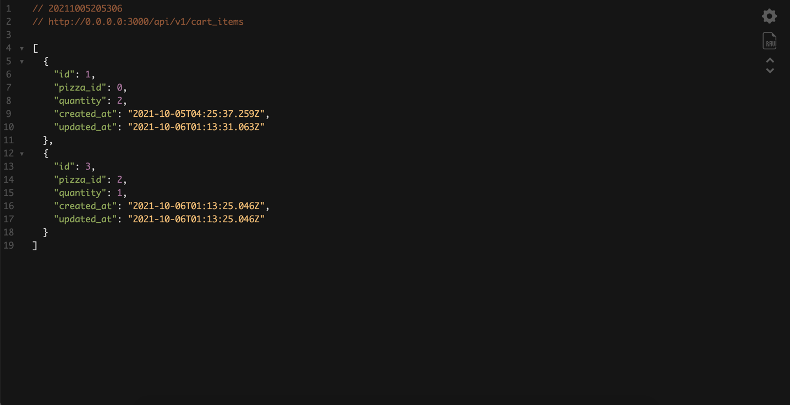

# Chez Sergio Rails Backend Project

## Table of contents

- [General info](#general-info)
- [Screenshots](#screenshots)
- [Technologies](#technologies)
- [Setup](#setup)
- [Test](#test)
- [Status](#status)
- [Contact](#contact)

## General info

This is the repository for the backend of the front end project Chez Sergio.
It handles the calls to the database and the different api routes.

Live Link : [https://chez-sergio.herokuapp.com/](https://chez-sergio.herokuapp.com/)

Vue.js Repository: [https://github.com/DiamessoGroup/chez-sergio](https://github.com/DiamessoGroup/chez-sergio)

## Screenshots

**API Pizza List**

**API Cart Items**

## Technologies

-   Ruby
-   Ruby on Rails 6

## Setup

After downloading the Git repository, follow the steps below to setup the application locally.

1. Run `rails bundle`
2. Run `npm install`
3. To create the database, run `rails db:create`
4. Migrate the migration files with `rails db:migrate`
5. Seed the database with some data with `rails db:seed`

## Test

To run api tests, you can run `rails test`

## Status

Project is: _finished_ but other features could be added.

## Contact

Created by Krishna Diamesso. You can contact me at info@diamessoprojects.com
